   
  
  
   
  
  

    
    
    
    
  

  <h3 align="center">✨ Hack The Winter: The Second Wave (Angry Bird Edition) ✨</h3>

---

  
<b>📂 Table of Contents (Click to Expand)</b>

   
  
  1. [The Vision](#-the-vision)
  2. [Problem Statement](#-the-silent-epidemic)
  3. [Solution Architecture](#-solution-architecture)
  4. [Episodic Memory Engine](#-the-core-innovation-episodic-memory)
  5. [Team Sicario](#-meet-team-sicario)
  6. [Tech Stack](#-tech-arsenal)
  7. [Setup & Installation](#-installation)

---

## 🔮 The Vision

> *"Memory is the diary that we all carry about with us." — Oscar Wilde*

But what happens when that diary starts losing pages? 

**SAHAYAK** is a cognitive support ecosystem designed to restore independence to Alzheimer's patients. Unlike passive trackers, Sahayak is an **active observer**. It "sees" what you see, "hears" what you hear, and builds a **Digital Episodic Memory** to answer questions about your daily life.

---

## 📉 The Silent Epidemic

Alzheimer's and Dementia strip away a person's ability to recall the **Context of Life**.

| 🚫 The Struggle | ❌ Existing "Smart" Tech | ✅ The Sahayak Way |
| :--- | :--- | :--- |
| **"Where is my wallet?"** | **GPS Trackers:** Only show map location. | **Visual Memory:** "You left it on the kitchen counter." |
| **"Who is this person?"** | **CCTV:** Passive recording. | **Face Rec:** "This is your grandson, Aryan." |
| **"Did I eat medicine?"** | **Alarms:** Ring blindly. | **Action Log:** "Yes, you took the blue pill at 2 PM." |

---

## ⚙️ Solution Architecture

We have engineered a **Modular Agent System** that runs entirely offline on the Edge.

```mermaid
graph LR
    subgraph Senses [Sense]
      A[👁️ Camera] -->|Frames| C(Vision Agent)
      B[👂 Mic] -->|Audio| D(Voice Agent)
    end

    subgraph Brain [Cognitive Core]
      C -->|Objects + People| E{Memory Engine}
      D -->|User Query| F(Query Agent)
      F <-->|Recall| E
    end

    subgraph Action [Act]
      E -->|Contextual Answer| G[🔊 Speech Output]
    end
    
    style Senses fill:#f9f,stroke:#333,stroke-width:2px
    style Brain fill:#bbf,stroke:#333,stroke-width:2px
    style Action fill:#bfb,stroke:#333,stroke-width:2px

```

---

## 🧬 The Core Innovation: Episodic Memory

Standard AI creates data. **Sahayak creates Stories.**
We utilize a custom JSON structure to mimic the human brain's **"Event Indexing"**.

| 🕰️ Time | 📦 Object | 📍 Location | 👤 Person | 📝 Generated Memory |
| --- | --- | --- | --- | --- |
| `06:54 PM` | `Glasses` | `Sofa` | `Mishu` | *"You kept your glasses on the sofa when Mishu was nearby."* |
| `07:10 PM` | `Keys` | `Dining Table` | `None` | *"Your car keys were last seen on the Dining Table."* |

---

## ⚔️ Meet Team Sicario

<table>
<tr>
<td align="center" width="25%">
<a href="https://www.linkedin.com/in/tanishaggarwal06/">
 
<b>Tanish Aggarwal</b>
</a> 
👑 <i>Team Lead & Edge Architect</i> 
Hardware Integration & Privacy
</td>
<td align="center" width="25%">
<a href="https://www.linkedin.com/in/chakshuarora716/">
 
<b>Chakshu Arora</b>
</a> 
🧠 <i>Brain Architect</i> 
Episodic Memory & Agents
</td>
<td align="center" width="25%">
<a href="https://www.linkedin.com/in/yash-goelcs/">
 
<b>Yash Goel</b>
</a> 
🗣️ <i>Voice Engineer</i> 
NLP & Accessibility
</td>
<td align="center" width="25%">
<a href="https://www.linkedin.com/in/anshuman-dutta-b62b37339/">
 
<b>Anshuman Dutta</b>
</a> 
👁️ <i>Visionary</i> 
Computer Vision (YOLO/CLIP)
</td>
</tr>
</table>

---

## 🛠 Tech Arsenal

| Component | Tech Choice | Why? |
| --- | --- | --- |
| **Brain** |  | Powerful enough for On-Device AI. |
| **Eyes** |  | Real-time detection + Semantic understanding. |
| **Ears** |  | Best-in-class offline speech recognition. |
| **Voice** |  | Natural, non-robotic responses. |

---

## 🗺️ Roadmap to Impact

* [x] **Prototype:** Core Vision & Memory loop active.
* [x] **Voice Interface:** Full duplex conversation.
* [ ] **Phase 2:** Fall Detection & Distress Signals. 🚨
* [ ] **Phase 3:** Mobile App for Caregiver Monitoring. 📱
* [ ] **Phase 4:** Sentiment Analysis for Anxiety Detection. ❤️

---

<i>Crafted with Empathy by Team Sicario for Hack The Winter ❄️</i>

