   
  
  
   
  
  

    
    
    
    
  

  <h3 align="center">✨ Hack The Winter: The Second Wave (Angry Bird Edition) ✨</h3>

---

  
<b>📂 Table of Contents (Click to Expand)</b>

   
  
  1. [The Vision](#-the-vision)
  2. [Problem Statement](#-the-silent-epidemic)
  3. [Solution Architecture](#-solution-architecture)
  4. [Episodic Memory Engine](#-the-core-innovation-episodic-memory)
  5. [Team Sicario](#-meet-team-sicario)
  6. [Tech Stack](#-tech-arsenal)
  7. [Setup & Installation](#-installation)

---

## 🔮 The Vision

> *"Memory is the diary that we all carry about with us." — Oscar Wilde*

But what happens when that diary starts losing pages? 

**SAHAYAK** is a cognitive support ecosystem designed to restore independence to Alzheimer's patients. Unlike passive trackers, Sahayak is an **active observer**. It "sees" what you see, "hears" what you hear, and builds a **Digital Episodic Memory** to answer questions about your daily life.

---

## 📉 The Silent Epidemic

Alzheimer's and Dementia strip away a person's ability to recall the **Context of Life**.

| 🚫 The Struggle | ❌ Existing "Smart" Tech | ✅ The Sahayak Way |
| :--- | :--- | :--- |
| **"Where is my wallet?"** | **GPS Trackers:** Only show map location. | **Visual Memory:** "You left it on the kitchen counter." |
| **"Who is this person?"** | **CCTV:** Passive recording. | **Face Rec:** "This is your grandson, Aryan." |
| **"Did I eat medicine?"** | **Alarms:** Ring blindly. | **Action Log:** "Yes, you took the blue pill at 2 PM." |

---

## ⚙️ Solution Architecture

We have engineered a **Modular Agent System** that runs entirely offline on the Edge.

```mermaid
graph LR
    subgraph Senses [Sense]
      A[👁️ Camera] -->|Frames| C(Vision Agent)
      B[👂 Mic] -->|Audio| D(Voice Agent)
    end

    subgraph Brain [Cognitive Core]
      C -->|Objects + People| E{Memory Engine}
      D -->|User Query| F(Query Agent)
      F <-->|Recall| E
    end

    subgraph Action [Act]
      E -->|Contextual Answer| G[🔊 Speech Output]
    end
    
    style Senses fill:#f9f,stroke:#333,stroke-width:2px
    style Brain fill:#bbf,stroke:#333,stroke-width:2px
    style Action fill:#bfb,stroke:#333,stroke-width:2px

```

## 🌟 Key Features: Why Sahayak stands out?

Sahayak is not just a reminder app; it is a **fully autonomous cognitive system**.

<table>
  <tr>
    <td width="50%" valign="top">
      <h3>🧠 Artificial Episodic Memory</h3>
      
Unlike standard assistants that fetch facts from Google, Sahayak builds a <b>personal timeline</b> of your life. It remembers <i>Who</i>, <i>What</i>, <i>Where</i>, and <i>When</i> an event happened using a custom JSON Event Indexer.

    </td>
    <td width="50%" valign="top">
      <h3>🔒 100% On-Device Privacy</h3>
      
<b>"Your memories stay yours."</b> The entire system runs offline on a <b>Raspberry Pi</b>. No video or audio is ever uploaded to the cloud, ensuring complete data sovereignty for the patient.

    </td>
  </tr>
  <tr>
    <td width="50%" valign="top">
      <h3>👁️ Semantic Vision Intelligence</h3>
      
Powered by <b>YOLOv8 + CLIP</b>, Sahayak doesn't just "detect" objects; it "understands" them. It distinguishes between <i>"Generic Glasses"</i> and <i>"MY Glasses"</i> and uses stability checks to avoid false memories.

    </td>
    <td width="50%" valign="top">
      <h3>🗣️ Zero-UI Voice Interaction</h3>
      
Designed for the elderly. No screens, no buttons. Just speak naturally. Using <b>OpenAI Whisper</b> (STT) and <b>Edge Neural TTS</b>, the conversation feels human, not robotic.

    </td>
  </tr>
  <tr>
    <td width="50%" valign="top">
      <h3>🤖 Multi-Agent Orchestration</h3>
      
A sophisticated backend where specialized AI Agents (Vision, Memory, Query) talk to each other. This modular design ensures that if one part fails, the system recovers automatically.

    </td>
    <td width="50%" valign="top">
      <h3>⌚ Wearable & Assistive Design</h3>
      
Compact integration with <b>Bone Conduction Audio</b> ensures the user stays aware of their surroundings while receiving private memory cues directly into their ear.

    </td>
  </tr>
</table>
---

## 🛠️ Tech Stack & Dependencies

Our system acts as a bridge between **Hardware** and **Advanced AI**.

### 🦾 Hardware Layer (The Body)
| Component | Specification | Functionality |
| :--- | :--- | :--- |
| **Compute Unit** |  | The central brain handling all Edge AI processing offline. |
| **Vision Sensor** |  | Captures high-res frames for the Vision Agent. |
| **Audio Input** |  | Captures user queries in real-time. |
| **Audio Output** |  | Delivers private, non-intrusive voice responses. |

### 🧠 AI & Perception Layer (The Mind)
| Technology | Model / Tool | Role in Sahayak |
| :--- | :--- | :--- |
| **Object Detection** |  | Detects objects (keys, medicine, glasses) instantly. |
| **Semantic Understanding** |  | Understands context & identifies specific people. |
| **Speech-to-Text** | -74aa9c?style=for-the-badge&logo=openai&logoColor=white) | Converts voice to text locally (Offline). |
| **Text-to-Speech** |  | Generates human-like natural voice output. |

### 💻 Core Software & Orchestration
| Component | Tech Stack | Description |
| :--- | :--- | :--- |
| **Language** |  | Primary logic and agent orchestration. |
| **Vision Lib** |  | Image processing and frame handling. |
| **Memory Store** |  | Storing episodic events (Time, Loc, Object). |

---

### ⚡ Installation & Setup Guide

Follow these steps to deploy Sahayak on a Raspberry Pi 5 (or 4B).

## 📋 Prerequisites

Device: Raspberry Pi 5 (Recommended) or Pi 4 (8GB RAM)

OS: Raspberry Pi OS (64-bit)

Python: 3.9 or 3.10

Internet: Required for initial model downloads

## 🟢 Step 1: Clone the Repository

Open your terminal on the Raspberry Pi and run:

git clone https://github.com/YourUsername/Sahayak.git
cd Sahayak

## 🟡 Step 2: Install System Dependencies

We need system-level tools for Audio and Vision.

sudo apt-get update
sudo apt-get install python3-pyaudio portaudio19-dev libcamera-dev ffmpeg -y

## 🟠 Step 3: Set Up Virtual Environment

Keep dependencies isolated.

python3 -m venv venv
source venv/bin/activate

## 🔵 Step 4: Install Python Requirements

Install YOLO, Whisper, EdgeTTS, etc.

pip install --upgrade pip
pip install -r requirements.txt

Note: First install may take 5–10 minutes (PyTorch).

## 🟣 Step 5: Hardware Connection

Camera: Connect Pi Camera Module 3 to CSI port

Mic: Plug USB Microphone

Speaker: 3.5mm jack or Bluetooth Bone Conduction

## 🔴 Step 6: Launch Sahayak
python main.py

---

## 🕹️ Usage Instructions

Once the system is running, **Sahayak** becomes your active memory companion. No buttons needed—just speak.

### 🟢 1. Positioning the Device
* Wear the device (or place the camera) such that it has a clear view of your table/room.
* Ensure the microphone is not covered by clothing.

### 🔵 2. Voice Commands
Sahayak listens for natural language. You don't need robotic commands.

| **Intent** | **Example User Query** | **Sahayak's Response** |
| :--- | :--- | :--- |
| **Locate Object** | *"Where did I keep my glasses?"* | *"You left your glasses on the coffee table 10 minutes ago."* |
| **Identify Person** | *"Who is standing in front of me?"* | *"That is your grandson, Aryan."* |
| **Recall Action** | *"Did I take my medicine?"* | *"Yes, I saw you taking the red pill at 2:00 PM."* |
| **General Context** | *"What was I doing just now?"* | *"You were reading a newspaper on the sofa."* |

### 💡 Pro Tips for Best Results
* **Stability Matters:** The memory is only formed when an object is stable for **3 seconds**. Don't wave objects around quickly.
* **Lighting:** Ensure the room is reasonably lit for the Camera to detect objects accurately.
---
## 🧬 The Core Innovation: Episodic Memory

Standard AI creates data. **Sahayak creates Stories.**
We utilize a custom JSON structure to mimic the human brain's **"Event Indexing"**.

| 🕰️ Time | 📦 Object | 📍 Location | 👤 Person | 📝 Generated Memory |
| --- | --- | --- | --- | --- |
| `06:54 PM` | `Glasses` | `Sofa` | `Mishu` | *"You kept your glasses on the sofa when Mishu was nearby."* |
| `07:10 PM` | `Keys` | `Dining Table` | `None` | *"Your car keys were last seen on the Dining Table."* |

---

## 📸 Screenshots & Demo

Here is Sahayak in action, processing the real world in real-time.

  

 

  <table>
    <tr>
      <td align="center">
        <b>👁️ Computer Vision View</b> 
        
         <i>YOLOv8 detecting 'cup' and 'keys'</i>
      </td>
      <td align="center">
        <b>🧠 Terminal / Memory Log</b> 
        
         <i>System creating JSON memory logs</i>
      </td>
    </tr>
  </table>

---

## 🌍 Real-World Impact & Use Cases

Sahayak is designed specifically to address the **"Context Gap"** faced by dementia patients.

### 🏥 Primary Use Case: Alzheimer's Care
| Problem Scenario | Sahayak's Solution | Impact |
| :--- | :--- | :--- |
| **The "Lost Item" Anxiety** Patient panics because they can't find their wallet. | **Visual Memory Recall** "It is on the bedside table." | Reduces panic attacks and dependency on caregivers. |
| **Social Withdrawal** Patient avoids guests because they don't recognize faces. | **Face Identity Whisper** "This is Sharma Ji, your neighbor." | Restores social confidence and dignity. |
| **Repetitive Questioning** Asking "What time is lunch?" 20 times. | **Patient Patience** AI answers calmly every single time without getting frustrated. | Reduces caregiver burnout. |

### 🏘️ Secondary Use Cases
* **Visually Impaired Assistance:** Helping blind users locate objects in a room.
* **Smart Home Automation:** Triggering lights/fans based on user location (Future integration).
---
## 🚀 Future Scope & Roadmap

We have a clear vision to evolve Sahayak from a prototype to a medical-grade product.

### 🗓️ Phase 1: Immediate Enhancements (Next 2 Months)
- [ ] **🔋 Battery Optimization:** Implementing "Sleep Mode" when no motion is detected to extend battery life to 12+ hours.
- [ ] **🚨 Fall Detection:** Using the camera's pose estimation to detect sudden falls and alert family members instantly.
- [ ] **🗣️ Hindi Language Support:** Training a fine-tuned Whisper model for local Indian dialects.

### 🗓️ Phase 2: Long-Term Vision (6 Months+)
- [ ] **📱 Caregiver Companion App:** A mobile dashboard for doctors/family to view memory logs and set safety geofences.
- [ ] **❤️ Emotion Analysis:** Analyzing voice tonality to detect if the patient is stressed or confused and calming them down.
- [ ] **☁️ Optional Cloud Sync:** Secure, encrypted cloud backup for long-term memory retrieval (e.g., "What did I do last Christmas?").

> *"Our ultimate goal is to make Sahayak invisible—technology that helps you live, without getting in the way."*
---
## ⚔️ Meet Team Sicario

<table>
  <tr>
    <td align="center" width="25%">
       
      <b>Tanish Aggarwal</b> 
       
      👑 <i>Team Lead</i> 
      Hardware & Edge Privacy
    </td>
    <td align="center" width="25%">
       
      <b>Chakshu Arora</b> 
       
      🧠 <i>Memory Architect</i> 
      Episodic Memory & Agents
    </td>
    <td align="center" width="25%">
       
      <b>Yash Goel</b> 
       
      🗣️ <i>Voice Engineer</i> 
      NLP & Accessibility
    </td>
    <td align="center" width="25%">
       
      <b>Anshuman Dutta</b> 
       
      👁️ <i>Vision Lead</i> 
      Computer Vision (YOLO/CLIP)
    </td>
  </tr>
</table>

**College:** Vivekananda Institute of Professional Studies (VIPS), Delhi 🏛️

---

     

  <h3>🌟 If you find Sahayak interesting, please give it a Star! 🌟</h3>
  
  
<i>"Preserving memories, one line of code at a time."</i>

   
  

    Made with ❤️ & ☕ by <b>Team Sicario</b> 
    <b>Hack The Winter (Round 1)</b>
  

